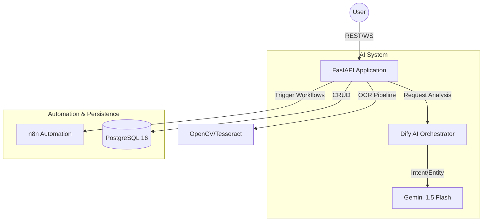

# 🏦 Finance AI: Next-Generation Financial Intelligence Ecosystem
### *An AI-Native platform with NLP Automation & Real-time Analytics*

<div align="center">

[](https://github.com/Tahumn/finance-ai-system/actions)


</div>

---

## 📖 Table of Contents
1. [Introduction & Vision](#-introduction--vision)
2. [System Architecture (Deep Dive)](#-system-architecture-deep-dive)
3. [Core Feature Modules](#-core-feature-modules)
4. [AI Technology & NLP Pipeline](#-ai-technology--nlp-pipeline)
5. [OCR Extraction Process](#-ocr-extraction-process)
6. [Tech Stack](#-tech-stack)
7. [Security & Performance](#-security--performance)
8. [Installation Guide](#-installation-guide)
9. [Product Showcase](#-product-showcase)
10. [Development Team](#-development-team)

---

## 🌟 Introduction & Vision

In the era of digital transformation, personal finance management is not just about "bookkeeping" but is an art of optimizing cash flow to achieve financial freedom. However, the greatest barrier that causes most users to give up is **"Input Friction"** – the tedious and time-consuming manual entry process.

**Finance AI Ecosystem** was created to redefine this experience through the philosophy of **"Zero-Friction Management"**. We eliminate the barriers between humans and data by putting Artificial Intelligence (AI) and Natural Language Processing (NLP) at the center of every interaction.

### Core Project Values:
*   **Data Intellect:** Transform lifeless natural language commands or invoice photos into structured, meaningful financial data.
*   **End-to-End Automation:** Leverage modern architecture and intelligent task queues to handle heavy background tasks, delivering a seamless user experience.
*   **Personalized Experience:** Beyond a simple storage tool, the system acts as a virtual financial assistant that understands spending behavior to provide optimal suggestions.

**Our Vision:** To become the leading personal financial management platform, empowering individuals to take control of their financial future through the power of modern technology.

---

## 🏗️ System Architecture (Deep Dive)

The system is designed with an **AI-Native Architecture**, combining the performance of FastAPI with an AI Orchestration ecosystem to optimize intelligent processing capabilities.

### 1. Core Components
The system comprises core components working in harmony:
*   **API Engine (FastAPI):** Serves as the central control hub, handling business logic, database management, and exposing RESTful APIs.
*   **AI Orchestrator (Dify.AI):** Manages AI agents, orchestrates smart conversations, and integrates Large Language Models (LLM - Gemini 1.5).
*   **Automation Hub (n8n):** Handles complex automated workflows, sends notifications, and connects external services.
*   **Data Store (PostgreSQL):** Stores transaction data with high integrity constraints.

### 2. Communication & Data Flow
The system uses a hybrid communication model to optimize performance:
*   **Synchronous (REST API):** Used for data flows requiring immediate responses, such as authentication and balance queries.
*   **Asynchronous (Background Tasks):** Uses background worker queues for time-consuming tasks like complex OCR processing and in-depth report analysis.

### 3. Architecture Diagram


---

## 🚀 Core Feature Modules

The system is organized into specialized business modules, working together to deliver a 360-degree financial management experience.

### 1. Transaction & Cashflow Management Module (Ledger Engine)
This is the "heart" of the system, designed to guarantee absolute financial data integrity:
*   **Multi-wallet Management:** Supports separate tracking for cash accounts, bank cards, and e-wallets using a precise ledger bookkeeping mechanism.
*   **Smart Transactions:** Records income, expenses, and internal transfers with multi-tier classification using Categories and Tags.
*   **Real-time Balance:** Balances are updated instantaneously upon any change, eliminating data latency.

### 2. Intelligent Automation Module (AI & OCR Automation Hub)
A breakthrough module that eliminates manual input barriers:
*   **AI Chat-to-Action:** Integrates LLMs to comprehend natural language context, enabling transaction creation via simple chat inputs (e.g., "Spent 50k on phở from cash wallet").
*   **High-Performance OCR Pipeline:** Automatically scans receipts, extracting merchant names, dates, and total amounts. Processing runs asynchronously to ensure a smooth user experience.
*   **Intelligent Suggestions:** AI automatically suggests expense categories based on historical habits, increasing categorization accuracy.

### 3. Strategic Financial Planning Module (Strategic Planning)
Helps users transition from tracking to controlling their finances:
*   **Smart Budgeting:** Set spending limits for each category and receive instant alerts when approaching threshold limits.
*   **Savings Goals:** Track savings progress for long-term goals (buying a house, purchasing a car) with visual roadmaps.
*   **Subscription Manager:** Automatically manages and reminds users of recurring expenses (Netflix, Spotify, iCloud...), eliminating unnecessary leakage.

### 4. Debt & Obligation Management Module
Solves the problem of managing loans and lending:
*   **Debt Tracking:** Tracks outstanding debts, interest rates, and repayment progress in detail.
*   **Reminder Engine:** Automatically sends repayment reminders when due, helping maintain financial credibility and avoid late fees.

### 5. Advanced Analytics & Reporting Module
Transforms raw data into actionable insights and charts:
*   **Cashflow Analytics:** Visualizes cash inflows/outflows over time using interactive charts.
*   **Spending Allocation:** Analyzes the share of expenditures to identify financial leaks.
*   **Financial Health Report:** Provides a comprehensive financial health assessment based on income, expenses, and savings metrics.

---

## 🤖 AI Technology & NLP Pipeline

The system features a natural language processing "brain" fine-tuned to optimize the comprehension of user financial intent.

### 1. Intent Classification
Utilizes advanced Large Language Models (Gemini 1.5 Flash) combined with **Few-shot Prompting** to accurately classify user actions:
*   `CREATE_TRANSACTION`: Create income/expense transactions.
*   `QUERY_REPORT`: Query financial status.
*   `SET_BUDGET`: Set budgets.
*   `FINANCIAL_ADVICE`: Request savings advice.

### 2. Named Entity Recognition (NER)
The system extracts core entities from natural language queries (e.g., "I just spent 100k buying books with my card"):
*   **Amount:** Automatically normalizes currency abbreviations and terms (e.g., k, million, dong).
*   **Subject:** Identifies the purpose of the expense (e.g., Book purchase).
*   **Account:** Identifies the source of funds (e.g., Card).
*   **Category:** Automatically categorizes the transaction based on context (e.g., Education/Books).

### 3. Self-Correction & Slot Filling Mechanism
If a query lacks critical information (e.g., missing amount or source account), the AI Agent triggers a **Slot Filling** mechanism—prompting the user with clarifying questions to complete the transaction details before saving to the database.

---

## 🖼️ Invoice Extraction Process (OCR Pipeline)

The system employs a 4-step image processing pipeline to guarantee maximum invoice extraction accuracy under real-world conditions.

### Step 1: Image Pre-processing
Uses image processing techniques to perform:
*   **Grayscale & Thresholding:** Converts images to grayscale and applies noise reduction to make text stand out.
*   **Perspective Correction:** Automatically corrects skewed or distorted receipts.

### Step 2: Text Detection & Extraction
Uses the **Tesseract OCR** engine integrated with Vietnamese language dictionaries and filters to translate text regions into string data.

### Step 3: AI Post-processing
This is the crucial step – raw text data is fed into the LLM to perform:
*   **Semantic Parsing:** Filters out noise (barcodes, invoice numbers) and retains only: Merchant Name, Transaction Date, Total Amount, VAT.
*   **Data Validation:** Validates database consistency and logic (e.g., Total Amount = Subtotal + Tax).

### Step 4: Asynchronous Processing
The entire OCR process runs in the background, allowing users to interact with the application immediately without waiting.

---

## 🛠️ Tech Stack

| Layer | Technology | Rationale |
| :--- | :--- | :--- |
| **Frontend** | React 18 + Vite | Blazing fast render speeds, smooth UX. |
| **Backend** | FastAPI (Python) | Performance comparable to Go/Node.js, excellent Type Hinting support. |
| **Database** | PostgreSQL 16 | Industry standard for financial data integrity. |
| **Automation** | n8n | Highly flexible for setting up automated workflows. |
| **AI** | Gemini 1.5 + Dify | Outstanding Vietnamese context comprehension. |

---

## 🛡️ Security & Performance

*   **Authentication:** Stateless JWT (JSON Web Tokens) secured via Bcrypt hashing.
*   **Authorization:** Role-Based Access Control (RBAC) to enforce data privacy.
*   **Optimization:** Caching of frequently accessed data to reduce PostgreSQL database load.
*   **Infrastructure:** Fully Dockerized system ensuring consistent deployment environments.

---

## ⚙️ Installation Guide

### Deployment with Docker (Recommended)
```bash
# Clone the project
git clone https://github.com/Tahumn/finance-ai-system.git
cd finance-ai-system

# Set up environment variables
cp .env.example .env

# Run the entire system
docker compose up -d --build
```

---

## 📸 Product Showcase

Below is the real-world look and feel of the **Finance AI** ecosystem, designed with a modern **Midnight Glassmorphism** aesthetic.

### 0. Login & Security Experience
The system uses secure authentication mechanisms and a minimalist, elegant login interface.


### 1. Dashboard System (Overview)
The central interface provides a 360-degree view of financial health with dynamic charts and real-time metrics.


### 2. Transaction Management
Intelligently categorized transaction lists with multi-tiered filtering support.


### 3. Cards & Payment Accounts
Flexible management of funds across bank cards and e-wallets.


### 4. OCR Extraction Technology
Automatically extracts data from receipt photos using AI.


### 5. Extracted Invoice Details
Extracted merchant name, date, and total amount from the OCR parser.


### 6. AI Virtual Assistant Chatbot
Interact and create transactions using natural language.


### 7. In-depth Analytical Reports
Analyzes spending shares and financial health using charts.


### 8. Notification Center
Real-time balance updates and budget alerts.


### 9. Financial Goal Setting
Tracks savings progress for long-term objectives.


### 10. System Customization & Settings
Configure user interface preferences and personal information.


---

## 🤝 Development Team

**Students of Class DCT122C5 - Saigon University**

| Member | GitHub |
| :--- | :--- |
| **Võ Kiều Anh** | [github.com/KieuAnh2204](https://github.com/KieuAnh2204) |
| **Nguyễn Thành Hưng** | [github.com/thungnguyen](https://github.com/thungnguyen) |
| **Đặng Nguyễn Tâm Như** | [github.com/Tahumn](https://github.com/Tahumn) |
| **Phạm Nguyễn Minh Châu** | [github.com/mmchouuu](https://github.com/mmchouuu) |

**Supervisor:** Dr. Do Nhu Tai

---
<div align="center">
  Made with ❤️ by Team Finance AI
</div>
