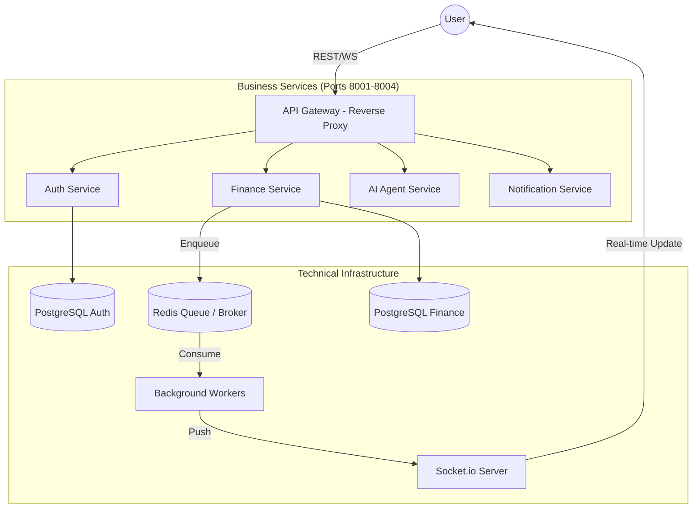

# 🏦 Finance AI: Next-Generation Financial Intelligence Ecosystem
### *A Microservices-driven platform with NLP Automation & Real-time Analytics*

<div align="center">

[](https://github.com/your-repo/finance-ai/actions)


</div>

---

## 📖 Table of Contents
1. [Introduction & Vision](#-introduction--vision)
2. [System Architecture (Deep Dive)](#-system-architecture-deep-dive)
3. [Core Features & Modules](#-core-features--modules)
4. [AI Technology & NLP Pipeline](#-ai-technology--nlp-pipeline)
5. [OCR Invoice Extraction Pipeline](#-ocr-invoice-extraction-pipeline)
6. [Tech Stack](#-tech-stack)
7. [Security & Performance](#-security--performance)
8. [Installation Guide](#-installation-guide)
9. [Product Showcase (Screenshots & Video)](#-product-showcase-screenshots--video)
10. [Development Team](#-development-team)

---

## 🌟 Introduction & Vision

In the digital transformation era, personal finance management is no longer just about "record-keeping" but the art of optimizing cash flow to achieve financial freedom. However, the biggest hurdle that causes most users to give up is **"Input Friction"**—the tedious and time-consuming manual process of logging data.

The **Finance AI Ecosystem** was born to redefine this experience through a **"Zero-Friction Management"** philosophy. We break down the barriers between users and their data by placing Artificial Intelligence (AI) and Natural Language Processing (NLP) at the core of every interaction.

### Core Values:
*   **Intelligent Data Processing:** Transform raw natural language queries or static receipt photos into structured, meaningful financial insights.
*   **End-to-End Automation:** Leverage a Service-Oriented Architecture (SOA) and intelligent task queuing to handle heavy background computations, delivering a seamless user experience.
*   **Personalized Experience:** Far beyond a simple storage tool, the system acts as a virtual financial assistant, analyzing spending behavior to offer optimized, tailored suggestions.

**Our Vision:** To become the leading personal finance management platform, empowering individuals to take control of their financial future through the power of advanced technology.

---

## 🏗️ System Architecture (Deep Dive)

The system is designed following a **Cloud-Native Microservices** architecture, isolating business domains to optimize scalability and high availability.

### 1. Service Decomposition
The system consists of independent core microservices:
*   **API Gateway (Gateway Main):** Acts as the single entry-point, responsible for request routing, load balancing, and securing the system.
*   **Auth Service:** Manages user identity, JWT authentication, and access control/authorization.
*   **Finance Service:** Manages the ledger (Ledger Engine), handles transactions, budgeting logic, and financial goals.
*   **AI Agent Service:** Bridges the platform and Large Language Models (LLMs), handling NLP intent recognition and entity extraction.
*   **Notification Service:** Manages notification dispatch and real-time status updates.

### 2. Inter-service Communication
The system utilizes a hybrid communication model to optimize performance:
*   **Synchronous (REST API):** Used for immediate response flows such as user authentication and balance queries.
*   **Asynchronous (Event-driven):** Uses **Redis Queue (RQ)** as the Message Broker for time-consuming tasks like OCR processing and email notifications. This keeps the main thread unblocked, maintaining response times under 200ms.

### 3. Storage & Data Consistency
*   **Database-per-service:** Each microservice owns its isolated PostgreSQL database, adhering to strict data isolation principles.
*   **Real-time Synchronization:** Uses **WebSockets (Socket.io)** to push balance updates from background workers to the client interface immediately after a transaction is processed, ensuring user interface consistency.

### 4. Data Flow Diagram


---

## 🚀 Core Features & Modules

The system is organized into specialized functional modules, working in harmony to provide a comprehensive 360-degree financial management experience.

### 1. Ledger & Cashflow Management Module (Ledger Engine)
The core system engine designed to guarantee absolute financial data integrity:
*   **Multi-Wallet Management:** Supports separate cash accounts, bank cards, and digital wallets backed by a precise double-entry/ledger accounting system.
*   **Smart Transactions:** Records income, expenses, and internal transfers with multi-tier classification using categories and tags.
*   **Real-time Balance:** Instant balance updates via WebSockets as changes occur, eliminating data latency.

### 2. Intelligent Automation Module (AI & OCR Automation Hub)
A pioneering module dedicated to removing manual data entry barriers:
*   **AI Chat-to-Action:** Built-in LLM parses natural language input, allowing users to create transactions via simple chat prompts (e.g., "Spent 50k on pho from cash wallet").
*   **High-Performance OCR Pipeline:** Automatically scans receipts, extracting merchant names, transaction dates, and total amounts. Processing runs asynchronously to keep the UI smooth and responsive.
*   **Intelligent Suggestions:** The AI suggests spending categories based on historical user habits, improving categorization accuracy over time.

### 3. Strategic Financial Planning Module
Empowering users to transition from simple tracking to proactive financial control:
*   **Smart Budgeting:** Set spending limits for specific categories and receive instant alerts as spending nears threshold limits.
*   **Savings Goals:** Track accumulation progress for long-term targets (e.g., buying a house or car) with interactive, visual roadmaps.
*   **Subscription Manager:** Automatically tracks and alerts recurring subscriptions (Netflix, Spotify, iCloud, etc.) to eliminate unnecessary or forgotten expenses.

### 4. Debt & Obligation Management Module
Streamlines the process of managing loans and borrowings:
*   **Debt Tracking:** Keeps detailed logs of outstanding debts, interest rates, and repayment progress.
*   **Reminder Engine:** Sends automated payment notifications as deadlines approach, preserving creditworthiness and avoiding late fees.

### 5. Advanced Analytics & Reporting Module
Transforms raw financial logs into high-value insights:
*   **Cashflow Analytics:** Interactive charts tracking cash inflows and outflows over time.
*   **Spending Allocation:** Analyzes expenditure proportions to identify potential financial leaks.
*   **Financial Health Report:** Delivers a comprehensive overview of financial stability based on income, expense, and savings ratios.

---

## 🤖 AI Technology & NLP Pipeline

The platform features a specialized natural language understanding engine tuned to interpret financial intents with high precision.

### 1. Intent Classification
Utilizes advanced LLMs (Gemini 1.5 Flash) coupled with **Few-shot Prompting** techniques to accurately identify user intent:
*   `CREATE_TRANSACTION`: Creates income/expense records.
*   `QUERY_REPORT`: Retrieves financial status reports.
*   `SET_BUDGET`: Establishes spending budgets.
*   `FINANCIAL_ADVICE`: Requests savings tips and advice.

### 2. Named Entity Recognition (NER)
Parses core information directly from natural sentences (e.g., "I spent 100k on books using card"):
*   **Amount:** Automatically normalizes diverse currency formats (e.g., "k", "triệu" -> million, "đồng").
*   **Subject:** Extracts the purpose of the transaction ("books").
*   **Account:** Pinpoints the source of funds ("card").
*   **Category:** Contextually categorizes the transaction (e.g., "Education/Books").

### 3. Auto-correction & Slot Filling Mechanism
When a natural command lacks crucial details (such as the amount or account), the AI Agent triggers a **Slot Filling** conversational loop, prompting the user for the missing details before registering the transaction in the ledger.

---

## 🖼️ OCR Invoice Extraction Pipeline

The system implements a 4-step image-processing pipeline to ensure optimal receipt data extraction under real-world conditions.

### Step 1: Image Pre-processing
Leverages the **OpenCV** library to perform:
*   **Grayscale & Thresholding:** Converts images to grayscale and applies noise-reduction filters to highlight text.
*   **Perspective Correction:** Automatically skews and aligns receipts captured at angles.

### Step 2: Text Detection & Extraction
Uses the **Tesseract OCR** engine with specialized Vietnamese language packs to convert text regions of the receipt image into raw strings.

### Step 3: AI Post-processing
The critical phase where raw OCR text is passed through the LLM for:
*   **Semantic Parsing:** Filters out clutter (e.g., barcodes, serial numbers) and isolates essential elements: Merchant Name, Transaction Date, Total Amount, VAT.
*   **Data Validation:** Logic checks on extracted figures (e.g., verifying if Total = Subtotal + Tax).

### Step 4: Asynchronous Offloading
The intensive image-processing pipeline is offloaded to the **Redis Queue (RQ)**. This ensures:
*   Users do not have to wait on the processing screen and can continue using the application.
*   The system broadcasts a "Process Successful" event via WebSockets to alert the user once parsing is complete.

---

## 🛠️ Tech Stack

| Layer | Technology | Rationale |
| :--- | :--- | :--- |
| **Frontend** | React 18 + Vite | Ultra-fast rendering and interactive UX. |
| **Backend** | FastAPI (Python) | High performance comparable to Go/Node.js, with robust type hinting support. |
| **Real-time** | Socket.io | Ensures immediate real-time state synchronization. |
| **Queue** | Redis + RQ | Handles heavy operations (OCR, Emails) asynchronously without blocking core API threads. |
| **AI** | Gemini 1.5 + Dify | Outstanding Vietnamese context comprehension and structuring. |

---

## 🛡️ Security & Performance

*   **Authentication:** Stateless JWT (JSON Web Tokens) secured with Bcrypt password hashing.
*   **Optimization:** Aggressive caching of frequently accessed queries using Redis to reduce load on the PostgreSQL database.
*   **CI/CD:** Automated pipelines validating code style/quality (Ruff) and running unit tests (Pytest) before deployment.

---

## ⚙️ Installation Guide

### Deployment via Docker (Recommended)
```bash
# Clone the project repository
git clone https://github.com/your-repo/finance-ai-system.git
cd finance-ai-system

# Set up the environment configuration
cp .env.example .env

# Spin up the full system in microservices mode
docker compose --profile micro up -d --build
```

---

## 📸 Product Showcase (Screenshots & Video)

Below is the visual representation of the **Finance AI** ecosystem, utilizing a modern **Midnight Glassmorphism** design system.

### 🎥 Product Demo Video
[](https://www.youtube.com/watch?v=EojIcG7BPcE)

*Watch a detailed technical demonstration of the system and its AI features here.*

### 0. Secure Authentication Experience
The system employs multi-factor authentication mechanisms alongside a sleek, minimalist login interface.


### 1. Central Dashboard (Overview)
The core interface providing a 360-degree overview of financial health with dynamic charts and real-time statistics.


### 2. Transaction Management
A smart, searchable ledger categorized efficiently with multi-level filtering support.


### 3. Cards & Payment Accounts
Flexible asset management supporting diverse cash flow sources from debit/credit cards to digital wallets.


### 4. AI-Driven OCR Extraction
Automated invoice and receipt scanning utilizing advanced AI.


### 5. Extracted Receipt Details
Output details showing merchant names, dates, sub-totals, and final balances extracted via OCR.


### 6. AI Conversational Assistant
Seamlessly interact and create ledger entries using natural language.


### 7. Advanced Analytical Reports
Deconstruct spending patterns and overall financial health using beautiful charts.


### 8. Notification Center
Stay updated on real-time balance changes and budget threshold alerts.


### 9. Financial Goal Planner
Visually set, manage, and track progress toward long-term savings goals.


### 10. System Configurations & Settings
Personalize user profiles, notifications, and visual styling.


---

## 🤝 Development Team

**Student Group - Class DCT122C5 - Saigon University**

| Member | GitHub |
| :--- | :--- |
| **Võ Kiều Anh** | [github.com/KieuAnh2204](https://github.com/KieuAnh2204) |
| **Nguyễn Thành Hưng** | [github.com/thungnguyen](https://github.com/thungnguyen) |
| **Đặng Nguyễn Tâm Như** | [github.com/Tahumn](https://github.com/Tahumn) |
| **Phạm Nguyễn Minh Châu** | [github.com/mmchouuu](https://github.com/mmchouuu) |

**Advisor:** Dr. Do Nhu Tai

---
<div align="center">
  Made with ❤️ by Team Finance AI
</div>
