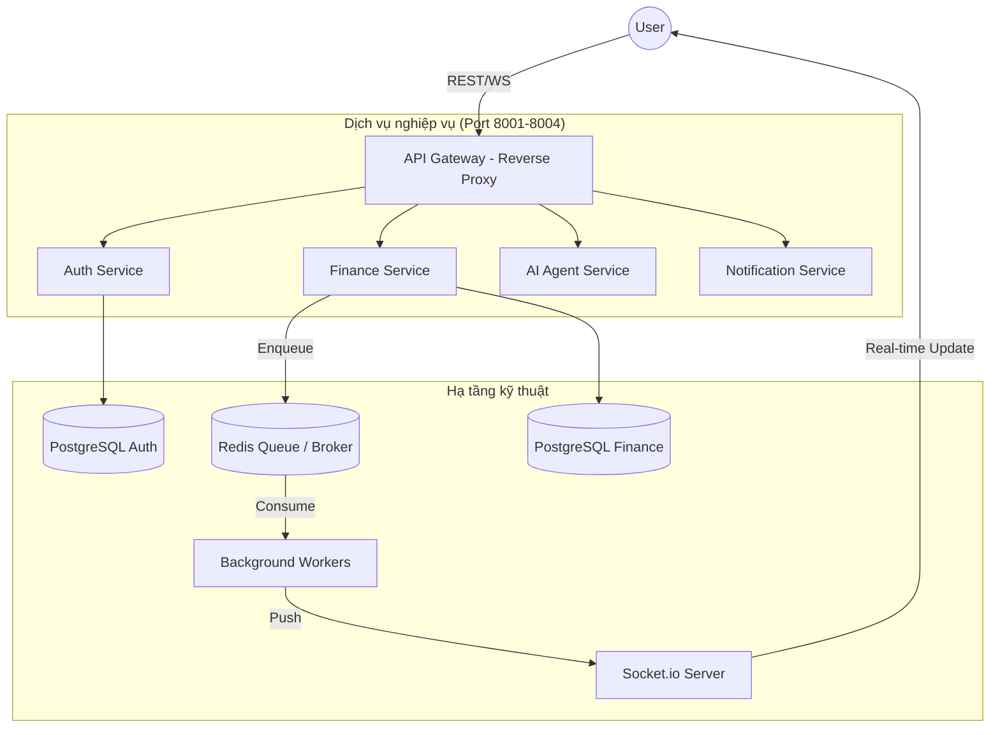
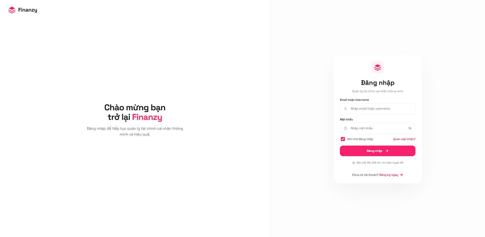
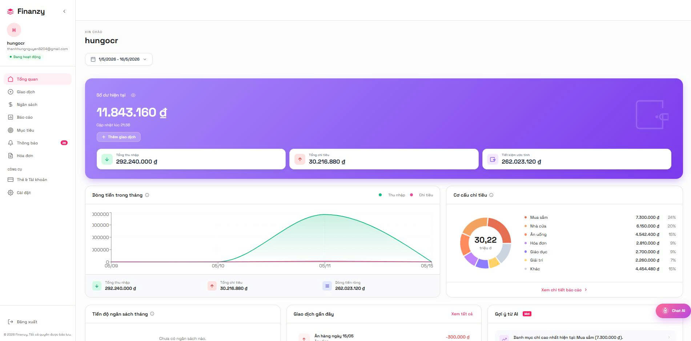
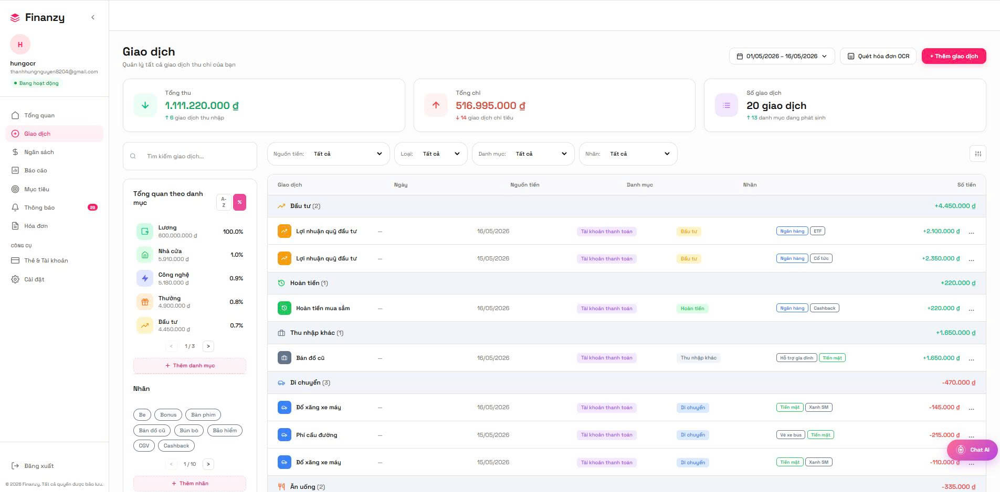
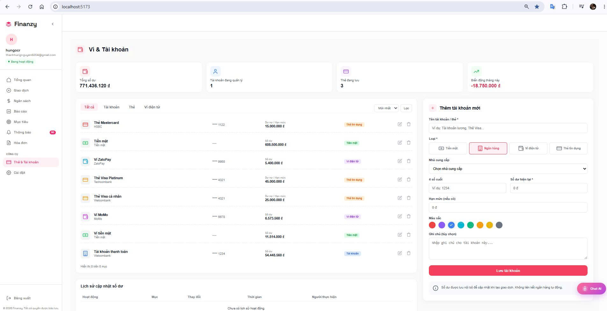
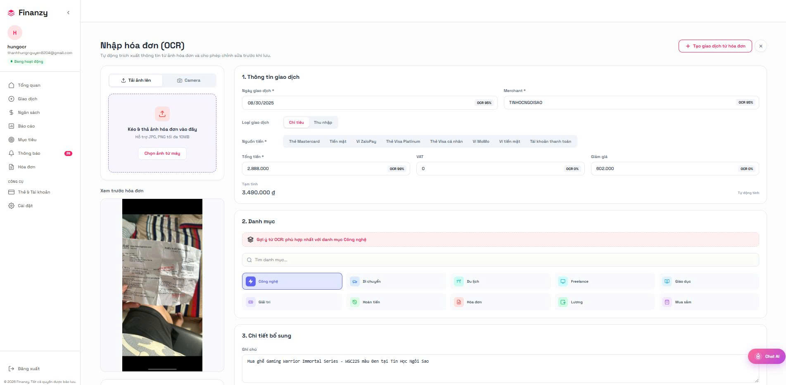
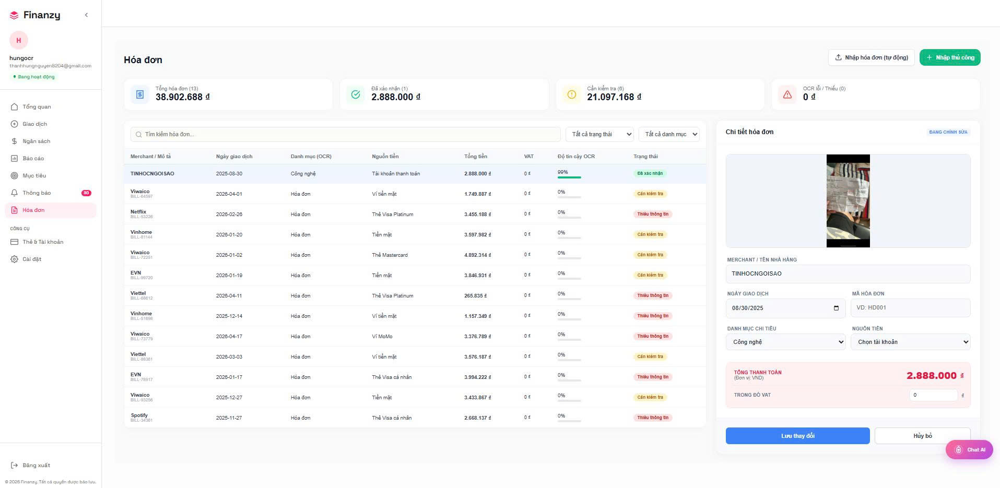
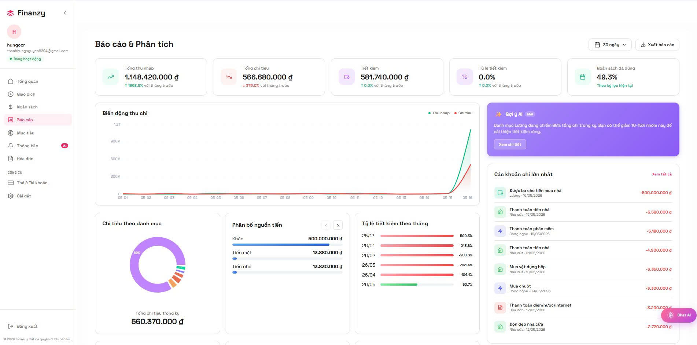
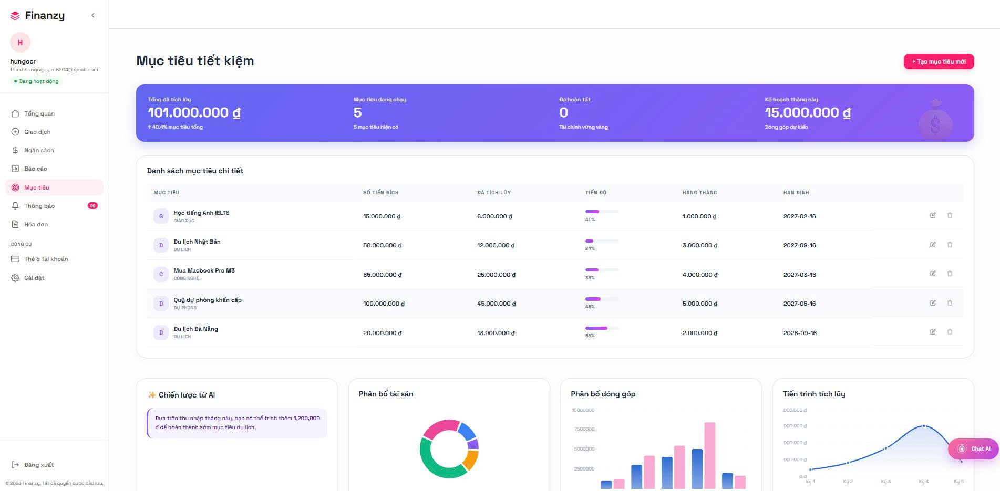
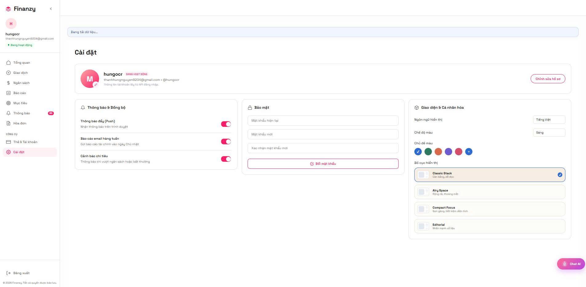

# 🏦 Finance AI: Next-Generation Financial Intelligence Ecosystem
### *A Microservices-driven platform with NLP Automation & Real-time Analytics*

<div align="center">

[](https://github.com/your-repo/finance-ai/actions)


</div>

---

## 📖 Mục lục (Table of Contents)
1. [Giới thiệu & Tầm nhìn](#-giới-thiệu--tầm-nhìn)
2. [Kiến trúc hệ thống (Deep Dive)](#-kiến-trúc-hệ-thống-deep-dive)
3. [Các phân hệ tính năng](#-các-phân-hệ-tính-năng)
4. [Công nghệ AI & NLP Pipeline](#-công-nghệ-ai--nlp-pipeline)
5. [Quy trình trích xuất OCR](#-quy-trình-trích-xuất-ocr)
6. [Nền tảng kỹ thuật (Tech Stack)](#-nền-tảng-kỹ-thuật-tech-stack)
7. [Bảo mật & Hiệu năng](#-bảo-mật--hiệu-năng)
8. [Hướng dẫn cài đặt](#-hướng-dẫn-cài-đặt)
9. [Minh họa sản phẩm (Screenshots & Video)](#-minh-họa-sản-phẩm)
10. [Đội ngũ thực hiện](#-đội-ngũ-thực-hiện)

---

## 🌟 Giới thiệu & Tầm nhìn

Trong kỷ nguyên chuyển đổi số, việc quản lý tài chính cá nhân không chỉ dừng lại ở việc "ghi chép", mà là nghệ thuật tối ưu hóa dòng tiền để đạt được tự do tài chính. Tuy nhiên, rào cản lớn nhất khiến đa số người dùng bỏ cuộc là **"Ma sát nhập liệu" (Input Friction)** – quy trình thủ công rườm rà và tốn thời gian.

**Finance AI Ecosystem** ra đời để tái định nghĩa trải nghiệm này thông qua triết lý **"Zero-Friction Management"**. Chúng tôi xóa bỏ rào cản giữa con người và số liệu bằng cách ứng dụng Trí tuệ nhân tạo (AI) và Xử lý ngôn ngữ tự nhiên (NLP) làm trung tâm của mọi tương tác.

### Giá trị cốt lõi của dự án:
*   **Trí tuệ hóa dữ liệu:** Biến những câu lệnh ngôn ngữ tự nhiên hoặc ảnh chụp hóa đơn vô hồn thành dữ liệu tài chính có cấu trúc và có ý nghĩa.
*   **Tự động hóa toàn diện:** Sử dụng kiến trúc hướng dịch vụ (SOA) và hàng đợi thông minh để xử lý mọi tác vụ nặng dưới nền, mang lại trải nghiệm người dùng liền mạch.
*   **Cá nhân hóa trải nghiệm:** Không chỉ là một công cụ lưu trữ, hệ thống đóng vai trò như một trợ lý tài chính ảo, thấu hiểu hành vi chi tiêu để đưa ra các gợi ý tối ưu.

**Tầm nhìn của chúng tôi:** Trở thành nền tảng quản trị tài chính cá nhân hàng đầu, giúp mỗi cá nhân làm chủ tương lai tài chính của mình thông qua sức mạnh của công nghệ hiện đại.

---

## 🏗️ Kiến trúc hệ thống (Deep Dive)

Hệ thống được thiết kế theo kiến trúc **Cloud-Native Microservices**, tách biệt hoàn toàn các domain nghiệp vụ để tối ưu hóa khả năng mở rộng (Scalability) và sự ổn định (Availability).

### 1. Mô hình phân rã dịch vụ (Service Decomposition)
Hệ thống bao gồm các dịch vụ cốt lõi hoạt động độc lập:
*   **API Gateway (Gateway Main):** Đóng vai trò là entry-point duy nhất, chịu trách nhiệm điều phối request (Request Routing) và bảo vệ hệ thống.
*   **Auth Service:** Quản lý định danh, xác thực JWT và phân quyền người dùng.
*   **Finance Service:** Quản lý sổ cái (Ledger Engine), xử lý logic giao dịch, ngân sách và mục tiêu tài chính.
*   **AI Agent Service:** Cầu nối giữa hệ thống và các mô hình LLM, xử lý NLP Intent và trích xuất thực thể.
*   **Notification Service:** Quản lý luồng thông báo và cập nhật trạng thái thời gian thực.

### 2. Giao tiếp giữa các dịch vụ (Inter-service Communication)
Hệ thống sử dụng mô hình giao tiếp hỗn hợp để tối ưu hóa hiệu năng:
*   **Synchronous (REST API):** Sử dụng cho các luồng dữ liệu cần phản hồi ngay lập tức như Xác thực và Truy vấn số dư.
*   **Asynchronous (Event-driven):** Sử dụng **Redis Queue (RQ)** làm Message Broker cho các tác vụ tốn thời gian như Xử lý OCR và Gửi Email thông báo. Điều này giúp Main Thread không bị block, duy trì Response Time < 200ms.

### 3. Tầng lưu trữ & Tính nhất quán dữ liệu (Storage & Consistency)
*   **Database-per-service:** Mỗi microservice sở hữu một database PostgreSQL riêng biệt, tuân thủ nguyên tắc cô lập dữ liệu.
*   **Real-time Sync:** Sử dụng **WebSockets (Socket.io)** để đẩy các cập nhật số dư từ Worker về Client ngay khi giao dịch được xác nhận dưới nền, đảm bảo tính nhất quán dữ liệu phía người dùng (UI Consistency).

### 4. Sơ đồ luồng dữ liệu (Data Flow Diagram)


---

## 🚀 Các phân hệ tính năng cốt lõi

Hệ thống được tổ chức thành các phân hệ nghiệp vụ chuyên sâu, phối hợp nhịp nhàng để mang lại trải nghiệm quản trị tài chính 360 độ.

### 1. Phân hệ Quản trị Giao dịch & Dòng tiền (Ledger Engine)
Đây là "trái tim" của hệ thống, được thiết kế để đảm bảo tính toàn vẹn dữ liệu tài chính tuyệt đối:
*   **Quản lý ví đa năng:** Hỗ trợ tách biệt tài khoản tiền mặt, thẻ ngân hàng, ví điện tử với cơ chế ghi sổ (Ledger) chính xác.
*   **Giao dịch thông minh:** Ghi nhận thu nhập, chi phí và chuyển khoản nội bộ với khả năng phân loại đa tầng qua Category và Tag.
*   **Real-time Balance:** Số dư được cập nhật tức thời qua WebSockets ngay khi có biến động, loại bỏ hoàn toàn độ trễ dữ liệu.

### 2. Phân hệ Tự động hóa thông minh (AI & OCR Automation Hub)
Phân hệ đột phá giúp xóa bỏ rào cản nhập liệu thủ công:
*   **AI Chat-to-Action:** Tích hợp LLM để hiểu ngữ cảnh ngôn ngữ tự nhiên, cho phép tạo giao dịch chỉ bằng một câu chat (Vd: "Ăn phở 50k từ ví tiền mặt").
*   **Pipeline OCR hiệu năng cao:** Tự động quét hóa đơn, bóc tách dữ liệu cửa hàng, ngày tháng và tổng tiền. Quá trình xử lý diễn ra bất đồng bộ, đảm bảo ứng dụng luôn mượt mà.
*   **Intelligent Suggestions:** AI tự động gợi ý hạng mục chi tiêu dựa trên thói quen lịch sử, giúp tăng độ chính xác khi phân loại dữ liệu.

### 3. Phân hệ Hoạch định Chiến lược tài chính (Strategic Planning)
Giúp người dùng chuyển từ trạng thái "theo dõi" sang "kiểm soát" tài chính:
*   **Smart Budgeting:** Thiết lập hạn mức chi tiêu cho từng hạng mục và nhận cảnh báo tức thời khi tiến sát ngưỡng nguy hiểm.
*   **Savings Goals:** Theo dõi tiến độ tích lũy cho các mục tiêu dài hạn (mua nhà, mua xe) với lộ trình trực quan.
*   **Subscription Manager:** Tự động quản lý và nhắc nhở các khoản phí định kỳ (Netflix, Spotify, iCloud...), giúp loại bỏ các chi phí lãng phí không đáng có.

### 4. Phân hệ Quản lý Công nợ & Nghĩa vụ (Debt & Obligation)
Giải quyết bài toán quản lý các khoản vay và cho vay:
*   **Debt Tracking:** Theo dõi dư nợ, lãi suất và tiến độ hoàn trả một cách chi tiết.
*   **Reminder Engine:** Tự động gửi thông báo nhắc nợ khi đến hạn, giúp duy trì uy tín tài chính và tránh các khoản phạt chậm trả.

### 5. Phân hệ Phân tích & Báo cáo chuyên sâu (Advanced Analytics)
Chuyển hóa dữ liệu thô thành các biểu đồ có giá trị (Insights):
*   **Cashflow Analytics:** Biểu đồ trực quan về dòng tiền vào/ra theo thời gian.
*   **Spending Allocation:** Phân tích tỷ trọng chi tiêu để nhận diện các "lỗ hổng" tài chính.
*   **Financial Health Report:** Đưa ra đánh giá tổng thể về sức khỏe tài chính dựa trên các chỉ số thu nhập/chi phí/tích lũy.

---

## 🤖 Công nghệ AI & NLP Pipeline

Hệ thống sở hữu một "bộ não" phân tích ngôn ngữ tự nhiên được tinh chỉnh để tối ưu hóa việc hiểu các ý định tài chính từ người dùng.

### 1. Phân tích ý định (Intent Classification)
Sử dụng các mô hình LLM tiên tiến (Gemini 1.5 Flash) kết hợp với kỹ thuật **Few-shot Prompting** để nhận diện chính xác các hành động của người dùng:
*   `CREATE_TRANSACTION`: Tạo giao dịch thu/chi.
*   `QUERY_REPORT`: Truy vấn tình hình tài chính.
*   `SET_BUDGET`: Thiết lập ngân sách.
*   `FINANCIAL_ADVICE`: Yêu cầu lời khuyên tiết kiệm.

### 2. Trích xuất thực thể (Named Entity Recognition - NER)
Hệ thống thực hiện bóc tách các thông tin cốt lõi từ câu lệnh tự nhiên (Vd: "Tôi vừa chi 100k mua sách bằng thẻ"):
*   **Amount (Số tiền):** Tự động chuẩn hóa các đơn vị tiền tệ (k, triệu, đồng).
*   **Subject (Nội dung):** Nhận diện mục đích chi tiêu (Mua sách).
*   **Account (Tài khoản):** Xác định nguồn tiền (Thẻ).
*   **Category (Hạng mục):** Tự động phân loại dựa trên ngữ cảnh (Giáo dục/Sách).

### 3. Cơ chế tự sửa lỗi & Slot Filling
Nếu câu lệnh thiếu thông tin quan trọng (Vd: thiếu số tiền hoặc tài khoản), AI Agent sẽ kích hoạt cơ chế **Slot Filling** – tự động đặt câu hỏi gợi ý để hoàn thiện dữ liệu giao dịch trước khi ghi vào cơ sở dữ liệu.

---

## 🖼️ Quy trình trích xuất hóa đơn (OCR Pipeline)

Hệ thống ứng dụng quy trình xử lý ảnh 4 bước để đảm bảo trích xuất dữ liệu hóa đơn với độ chính xác cao nhất ngay cả trong điều kiện thực tế.

### Bước 1: Tiền xử lý hình ảnh (Image Pre-processing)
Sử dụng thư viện **OpenCV** để thực hiện:
*   **Grayscale & Thresholding:** Chuyển đổi ảnh sang đen trắng và khử nhiễu để làm nổi bật văn bản.
*   **Perspective Correction:** Tự động căn chỉnh các hóa đơn bị chụp nghiêng hoặc méo.

### Bước 2: Nhận diện văn bản (Text Detection & Extraction)
Sử dụng engine **Tesseract OCR** kết hợp với các bộ lọc ngôn ngữ tiếng Việt để chuyển đổi các vùng ảnh chứa văn bản thành chuỗi ký tự (String data).

### Bước 3: Hậu xử lý bằng AI (AI Post-processing)
Đây là bước quan trọng nhất – dữ liệu thô từ Tesseract được đưa qua LLM để:
*   **Semantic Parsing:** Loại bỏ các thông tin rác (mã vạch, số hóa đơn) và chỉ giữ lại: Tên cửa hàng, Ngày giao dịch, Tổng tiền, VAT.
*   **Data Validation:** Kiểm tra tính logic của dữ liệu (Vd: Tổng tiền = Tiền hàng + Thuế).

### Bước 4: Xử lý bất đồng bộ (Asynchronous Offloading)
Toàn bộ quá trình xử lý ảnh được đẩy vào hàng đợi **Redis Queue (RQ)**. Điều này giúp:
*   Người dùng có thể tiếp tục sử dụng ứng dụng ngay lập tức mà không cần chờ đợi.
*   Hệ thống sẽ đẩy thông báo "Xử lý thành công" qua WebSockets ngay khi dữ liệu sẵn sàng.

---

## 🛠️ Nền tảng kỹ thuật (Tech Stack)

| Layer | Technology | Rationale |
| :--- | :--- | :--- |
| **Frontend** | React 18 + Vite | Tốc độ render cực nhanh, UX mượt mà. |
| **Backend** | FastAPI (Python) | Hiệu năng tiệm cận Go/NodeJS, hỗ trợ Type Hinting tốt. |
| **Real-time** | Socket.io | Đảm bảo tính nhất quán dữ liệu tức thời. |
| **Queue** | Redis + RQ | Xử lý các tác vụ nặng (OCR, Email) mà không chặn API. |
| **AI** | Gemini 1.5 + Dify | Khả năng hiểu ngữ cảnh tiếng Việt xuất sắc. |

---

## 🛡️ Bảo mật & Hiệu năng

*   **Xác thực:** JWT (JSON Web Token) với cơ chế Stateless, bảo mật qua Bcrypt hashing.
*   **Tối ưu hóa:** Caching dữ liệu thường xuyên truy cập vào Redis để giảm tải cho PostgreSQL.
*   **CI/CD:** Pipeline tự động kiểm tra code quality (Ruff) và unit tests (Pytest) trước khi deploy.

---

## ⚙️ Hướng dẫn cài đặt

### Triển khai với Docker (Recommended)
```bash
# Clone project
git clone https://github.com/your-repo/finance-ai-system.git
cd finance-ai-system

# Thiết lập môi trường
cp .env.example .env

# Chạy toàn bộ hệ thống
docker compose --profile micro up -d --build
```

---

## 📸 Minh họa sản phẩm (Showcase)

Dưới đây là diện mạo thực tế của hệ sinh thái **Finance AI** với ngôn ngữ thiết kế **Midnight Glassmorphism** hiện đại.

### 🎥 Video Demo Sản phẩm
[](https://www.youtube.com/watch?v=EojIcG7BPcE)

*Xem video demo chi tiết về hệ thống và các tính năng AI tại đây.*

### 0. Trải nghiệm Đăng nhập & Bảo mật
Hệ thống sử dụng cơ chế xác thực đa nhân tố và giao diện đăng nhập tối giản, tinh tế.


### 1. Hệ thống Dashboard (Tổng quan)
Giao diện trung tâm cung cấp cái nhìn 360 độ về sức khỏe tài chính với các biểu đồ động và thông số thời gian thực.


### 2. Quản lý Giao dịch
Danh sách giao dịch được phân loại thông minh, hỗ trợ lọc đa tầng.


### 3. Thẻ & Tài khoản thanh toán
Quản lý linh hoạt các nguồn tiền từ thẻ ngân hàng đến ví điện tử.


### 4. Công nghệ trích xuất OCR
Tự động bóc tách dữ liệu từ ảnh chụp hóa đơn bằng AI.


### 5. Chi tiết hóa đơn trích xuất
Kết quả bóc tách dữ liệu cửa hàng, ngày tháng và tổng tiền từ OCR.


### 6. Trợ lý ảo AI Chatbot
Tương tác và tạo giao dịch bằng ngôn ngữ tự nhiên.


### 7. Báo cáo phân tích chuyên sâu
Phân tích tỷ trọng chi tiêu và sức khỏe tài chính qua biểu đồ.


### 8. Trung tâm thông báo
Cập nhật biến động số dư và cảnh báo ngân sách thời gian thực.


### 9. Thiết lập mục tiêu tài chính
Theo dõi tiến độ tích lũy cho các mục tiêu dài hạn.


### 10. Tùy chỉnh & Cài đặt hệ thống
Cấu hình giao diện và thông tin cá nhân.


---

## 🤝 Đội ngũ thực hiện

**Nhóm sinh viên Lớp DCT122C5 - Trường Đại học Sài Gòn**

| Thành viên | GitHub |
| :--- | :--- |
| **Võ Kiều Anh** | [github.com/KieuAnh2204](https://github.com/KieuAnh2204) |
| **Nguyễn Thành Hưng** | [github.com/thungnguyen](https://github.com/thungnguyen) |
| **Đặng Nguyễn Tâm Như** | [github.com/Tahumn](https://github.com/Tahumn) |
| **Phạm Nguyễn Minh Châu** | [github.com/mmchouuu](https://github.com/mmchouuu) |

**Giảng viên hướng dẫn:** TS. Đỗ Như Tài

---
<div align="center">
  Made with ❤️ by Team Finance AI
</div>
